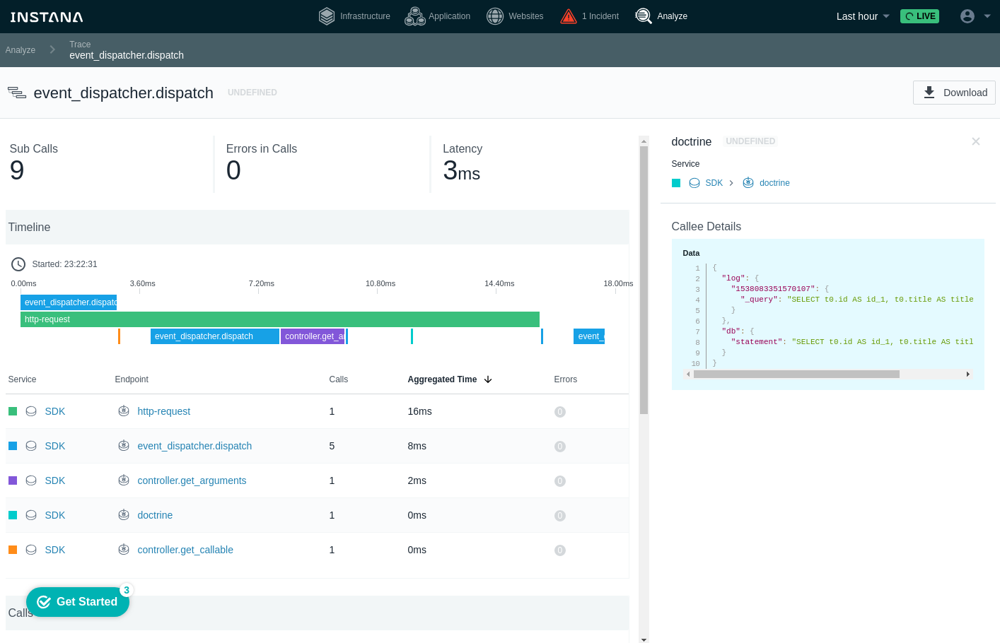

# [WIP] Instana OpenTracing Bundle

**Note, this project is not affiliated with, nor endorsed by instana**

This bundle aims to explore how to integrate a PHP application
into Instanas tracing tool.

It doesnt make use of the C-extension, but rather uses the
instana PHP SDK in combination with the OpenTracing PHP SDK.

The main goal is to integrate the crucial parts of the application framework
with the instrumentation.

The result is impressive - it's a bit like having the debug bar in
production.

## Current state

Currently, the bundle can:

* hook into the doctrine database connection to log queries
* hook into the event dispatcher
* time both `ArgumentResolver` and `ControllerResolver`

## Extensibility

One should be able to extend the tracing by simply injecting the
`opentracing.tracer.default` service into any of your services,
create a new span and it's done.

## License

MIT
